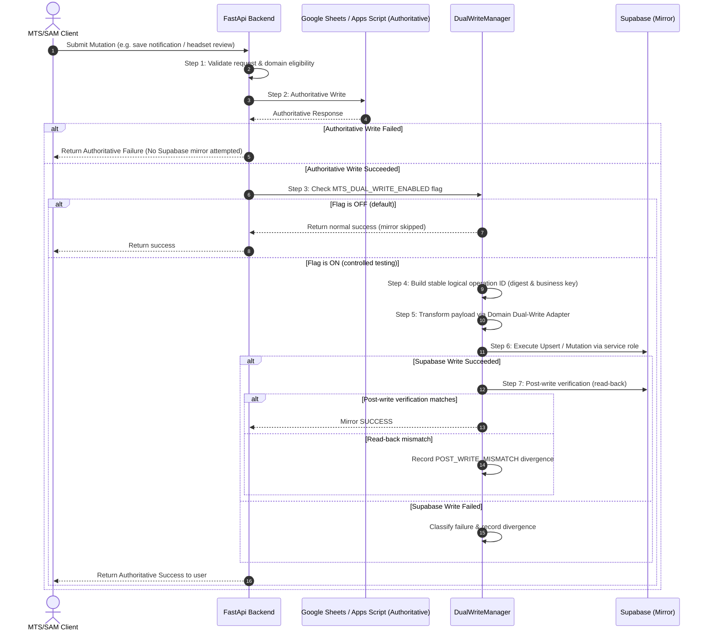

# MTS/SAM Supabase Dual-Write Framework

## 1. Overview & Operational Guardrails

The MTS/SAM Dual-Write Framework provides a reliable, verified mirror replication layer from authoritative Google Sheets / Apps Script storage to Supabase PostgreSQL.

### Production Guardrails
- **Google Sheets / Apps Script remains authoritative**: `MTS_DATA_PROVIDER=sheets`
- **Dual-Write Feature Flag default is OFF**: `MTS_DUAL_WRITE_ENABLED=false` (guarantees zero Supabase mirror writes during normal runtime)
- **Shadow Comparison active**: `MTS_SHADOW_COMPARE=true`
- **Apps Script active**: `YES`
- **Provider cutover**: `NO`

---

## 2. Order of Execution

Every operational mutation follows a strict seven-step pipeline:

---

## 3. Authoritative vs Mirror Failure Rules

### Authoritative Failure Rule
If the Google Sheets / Apps Script write fails or raises an error:
- **Zero mirror writes are attempted to Supabase.**
- The normal authoritative error is returned directly to the caller.
- No partial or orphaned mirror state is created.

### Mirror Failure Rule
If the authoritative Google Sheets write succeeds, but the Supabase mirror or post-write verification fails:
- The user's action **remains successful** authoritatively.
- The Google Sheets write is **not rolled back**.
- The divergence is classified and recorded in the `DualWriteDivergenceTracker` for repair/retry.
- Normal end-user experience is not degraded.

---

## 4. Domain Classification & Allowlist Matrix

| Domain Name | Classification | Dual-Write Eligible | Target Table | Conflict Key |
|---|---|:---:|---|---|
| `notifications` | LIVE APPLICATION WRITE | **YES** | `mts_sam.notifications` | `notification_id` |
| `headset_reviews` | LIVE APPLICATION WRITE | **YES** | `mts_sam.headset_reviews` | `id` |
| `candidate_sessions` | LIVE APPLICATION WRITE | **YES** | `mts_sam.candidate_sessions` | `session_id` |
| `candidates` | LIVE APPLICATION WRITE | **YES** | `mts_sam.candidates` | `source_candidate_id` |
| `session_attempts` | LIVE APPLICATION WRITE | **YES** | `mts_sam.session_attempts` | `id` |
| `supervisor_transfers` | LIVE APPLICATION WRITE | **YES** | `mts_sam.supervisor_transfers` | `transfer_id` |
| `newbie_shift_requests` | LIVE APPLICATION WRITE | **YES** | `mts_sam.newbie_shift_requests` | `request_id` |
| `candidate_corrections` | LIVE APPLICATION WRITE | **YES** | `mts_sam.candidate_corrections` | `request_id` |
| `pending_requests` | LIVE APPLICATION WRITE | **YES** | `mts_sam.pending_requests` | `request_id` |
| `candidate_status_actions` | AUDIT LOG ACTION | **YES** | `mts_sam.candidate_status_actions` | `id` |
| `extra_attempt_grants` | ADMIN GRANT ACTION | **YES** | `mts_sam.extra_attempt_grants` | `id` |
| `callers` | CONFIG / REFERENCE TAB | **NO** (Admin import only) | `mts_sam.caller_roster` | `caller_id` |
| `call_types` | CONFIG / REFERENCE TAB | **NO** (Admin import only) | `mts_sam.call_type_config` | `call_type_id` |
| `call_fail_reasons` | CONFIG / REFERENCE TAB | **NO** (Admin import only) | `mts_sam.call_fail_reason_config` | `reason_id` |
| `supervisor_coaching` | CONFIG / REFERENCE TAB | **NO** (Admin import only) | `mts_sam.supervisor_coaching_config` | `coaching_id` |
| `supervisor_fail_reasons` | CONFIG / REFERENCE TAB | **NO** (Admin import only) | `mts_sam.supervisor_fail_reason_config` | `reason_id` |
| `supervisor_reasons` | CONFIG / REFERENCE TAB | **NO** (Admin import only) | `mts_sam.supervisor_reason_config` | `reason_id` |
| `shows` | CONFIG / REFERENCE TAB | **NO** (Admin import only) | `mts_sam.show_schedule_config` | `show_id` |
| `gemini_coaching_prompt` | CONFIG / REFERENCE TAB | **NO** (Admin import only) | `mts_sam.ai_prompt_config` | `prompt_key` |
| `gemini_fail_prompt` | CONFIG / REFERENCE TAB | **NO** (Admin import only) | `mts_sam.ai_prompt_config` | `prompt_key` |
| `auth_users` | SECURITY / IDENTITY | **NO** (Supabase Auth direct) | `auth.users` | `id` |

---

## 5. Failure Classification

Every mirror attempt outcome is categorized into an explicit `DualWriteFailureClass`:

1. `SUCCESS`: Authoritative write succeeded, Supabase mirror succeeded, and post-write verification confirmed match.
2. `DUPLICATE_ALREADY_APPLIED`: Mirror write detected an already-applied identical payload.
3. `TRANSIENT_FAILURE`: Network timeout, 5xx gateway error, or Supabase service unavailability (retryable).
4. `PERMANENT_VALIDATION_FAILURE`: Schema constraint or invalid payload format (non-retryable without payload fix).
5. `AUTHORIZATION_DENIED`: 401/403 service role credential issue.
6. `PRECONDITION_MISMATCH`: Target state precondition does not match expected state.
7. `CONFLICT`: 409 unique key collision with different entity mapping.
8. `POST_WRITE_MISMATCH`: Write executed without HTTP error, but read-back verification detected field differences.
9. `UNSUPPORTED_DOMAIN`: Domain requested is not in the dual-write allowlist.

---

## 6. Idempotency & Operation Identity

Operation identities are generated deterministically:
`dw-{domain}-{mutation_type}-{safe_business_key}-{payload_sha256_digest_16}`

Repeated invocations with identical payloads yield the exact same operation identity. Upsert operations use PostgreSQL `ON CONFLICT ({conflict_key}) DO UPDATE` (`resolution='merge-duplicates'`), guaranteeing that retries are safe and idempotency is preserved.

---

## 7. Security Boundaries

- **Service Role Key Isolation**: Supabase mutations use the trusted backend service role key executed purely on the server.
- **Client Protection**: The packaged Electron/React client never receives or stores `SUPABASE_SERVICE_ROLE_KEY`.
- **Least Privilege**: Client interactions continue to route through standard backend REST API endpoints (`/notifications/manage`, `/headsets/reviews/action`, etc.).
