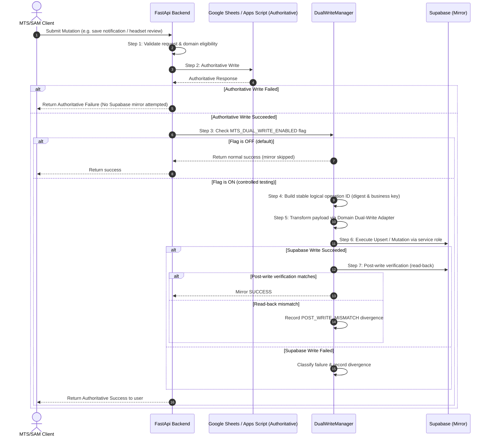

# MTS/SAM Supabase Dual-Write Framework

## 1. Overview & Operational Guardrails

The MTS/SAM Dual-Write Framework provides a reliable, verified mirror replication layer from authoritative Google Sheets / Apps Script storage to Supabase PostgreSQL.

### Production Guardrails
- **Google Sheets / Apps Script remains authoritative**: `MTS_DATA_PROVIDER=sheets`
- **Dual-Write Feature Flag default is OFF**: `MTS_DUAL_WRITE_ENABLED=false` (guarantees zero Supabase mirror writes during normal runtime)
- **Shadow Comparison active**: `MTS_SHADOW_COMPARE=true`
- **Apps Script active**: `YES`
- **Provider cutover**: `NO`

---

## 2. Order of Execution

Every operational mutation follows a strict seven-step pipeline:

---

## 3. Authoritative vs Mirror Failure Rules

### Authoritative Failure Rule
If the Google Sheets / Apps Script write fails or raises an error:
- **Zero mirror writes are attempted to Supabase.**
- The normal authoritative error is returned directly to the caller.
- No partial or orphaned mirror state is created.

### Mirror Failure Rule
If the authoritative Google Sheets write succeeds, but the Supabase mirror or post-write verification fails:
- The user's action **remains successful** authoritatively.
- The Google Sheets write is **not rolled back**.
- The divergence is classified and recorded in the `DualWriteDivergenceTracker` for repair/retry.
- Normal end-user experience is not degraded.

---

## 4. Domain Classification & Allowlist Matrix

| Domain Name | Classification | Dual-Write Eligible | Target Table | Conflict Key |
|---|---|:---:|---|---|
| `notifications` | LIVE APPLICATION WRITE | **YES** | `mts_sam.notifications` | `notification_id` |
| `headset_reviews` | LIVE APPLICATION WRITE | **YES** | `mts_sam.headset_reviews` | `id` |
| `candidate_sessions` | LIVE APPLICATION WRITE | **YES** | `mts_sam.candidate_sessions` | `session_id` |
| `candidates` | LIVE APPLICATION WRITE | **YES** | `mts_sam.candidates` | `source_candidate_id` |
| `session_attempts` | LIVE APPLICATION WRITE | **YES** | `mts_sam.session_attempts` | `id` |
| `supervisor_transfers` | LIVE APPLICATION WRITE | **YES** | `mts_sam.supervisor_transfers` | `transfer_id` |
| `newbie_shift_requests` | LIVE APPLICATION WRITE | **YES** | `mts_sam.newbie_shift_requests` | `request_id` |
| `candidate_corrections` | LIVE APPLICATION WRITE | **YES** | `mts_sam.candidate_corrections` | `request_id` |
| `pending_requests` | LIVE APPLICATION WRITE | **YES** | `mts_sam.pending_requests` | `request_id` |
| `candidate_status_actions` | AUDIT LOG ACTION | **YES** | `mts_sam.candidate_status_actions` | `id` |
| `extra_attempt_grants` | ADMIN GRANT ACTION | **YES** | `mts_sam.extra_attempt_grants` | `id` |
| `callers` | CONFIG / REFERENCE TAB | **NO** (Admin import only) | `mts_sam.caller_roster` | `caller_id` |
| `call_types` | CONFIG / REFERENCE TAB | **NO** (Admin import only) | `mts_sam.call_type_config` | `call_type_id` |
| `call_fail_reasons` | CONFIG / REFERENCE TAB | **NO** (Admin import only) | `mts_sam.call_fail_reason_config` | `reason_id` |
| `supervisor_coaching` | CONFIG / REFERENCE TAB | **NO** (Admin import only) | `mts_sam.supervisor_coaching_config` | `coaching_id` |
| `supervisor_fail_reasons` | CONFIG / REFERENCE TAB | **NO** (Admin import only) | `mts_sam.supervisor_fail_reason_config` | `reason_id` |
| `supervisor_reasons` | CONFIG / REFERENCE TAB | **NO** (Admin import only) | `mts_sam.supervisor_reason_config` | `reason_id` |
| `shows` | CONFIG / REFERENCE TAB | **NO** (Admin import only) | `mts_sam.show_schedule_config` | `show_id` |
| `gemini_coaching_prompt` | CONFIG / REFERENCE TAB | **NO** (Admin import only) | `mts_sam.ai_prompt_config` | `prompt_key` |
| `gemini_fail_prompt` | CONFIG / REFERENCE TAB | **NO** (Admin import only) | `mts_sam.ai_prompt_config` | `prompt_key` |
| `auth_users` | SECURITY / IDENTITY | **NO** (Supabase Auth direct) | `auth.users` | `id` |

---

## 5. Failure Classification

Every mirror attempt outcome is categorized into an explicit `DualWriteFailureClass`:

1. `SUCCESS`: Authoritative write succeeded, Supabase mirror succeeded, and post-write verification confirmed match.
2. `DUPLICATE_ALREADY_APPLIED`: Mirror write detected an already-applied identical payload.
3. `TRANSIENT_FAILURE`: Network timeout, 5xx gateway error, or Supabase service unavailability (retryable).
4. `PERMANENT_VALIDATION_FAILURE`: Schema constraint or invalid payload format (non-retryable without payload fix).
5. `AUTHORIZATION_DENIED`: 401/403 service role credential issue.
6. `PRECONDITION_MISMATCH`: Target state precondition does not match expected state.
7. `CONFLICT`: 409 unique key collision with different entity mapping.
8. `POST_WRITE_MISMATCH`: Write executed without HTTP error, but read-back verification detected field differences.
9. `UNSUPPORTED_DOMAIN`: Domain requested is not in the dual-write allowlist.

---

## 6. Idempotency & Operation Identity

Operation identities are generated deterministically:
`dw-{domain}-{mutation_type}-{safe_business_key}-{payload_sha256_digest_16}`

Repeated invocations with identical payloads yield the exact same operation identity. Upsert operations use PostgreSQL `ON CONFLICT ({conflict_key}) DO UPDATE` (`resolution='merge-duplicates'`), guaranteeing that retries are safe and idempotency is preserved.

---

## 7. Security Boundaries

- **Service Role Key Isolation**: Supabase mutations use the trusted backend service role key executed purely on the server.
- **Client Protection**: The packaged Electron/React client never receives or stores `SUPABASE_SERVICE_ROLE_KEY`.
- **Least Privilege**: Client interactions continue to route through standard backend REST API endpoints (`/notifications/manage`, `/headsets/reviews/action`, etc.).

---

## 8. Per-Domain Runtime Activation Gate

To guarantee strict canary isolation, runtime dual-write mirroring requires both the global flag AND the per-domain allowlist:
- `MTS_DUAL_WRITE_ENABLED=true`
- `MTS_DUAL_WRITE_DOMAINS=notifications` (comma-separated list of enabled domains)

If `MTS_DUAL_WRITE_DOMAINS` is not set or empty, all domains fail closed with `mirror_attempted=false` and `mirror_status='skipped_domain_not_allowlisted'`. When set to a specific domain (such as `notifications`), any write to other domains (e.g. `headset_reviews`, `candidate_sessions`) returns `mirror_attempted=false` immediately without touching Supabase.

---

## 9. Live Notification Canary Verification

The live canary test confirmed end-to-end mirror synchronization with live Google Sheets authority and hosted Supabase target `xyfhikikddcqcmzbdvbj`:

| Canary Step | Authoritative Write (Sheets) | Supabase Mirror | Post-Write Verification | Verified Semantics |
|---|:---:|:---:|:---:|---|
| **Canary 1: Low-Risk Edit** | SUCCESS | SUCCESS | SUCCESS | Title & message update mirrored cleanly |
| **Canary 2: Schedule / Time Edit** | SUCCESS | SUCCESS | SUCCESS | Local Eastern time normalized to `starts_at` timestamptz |
| **Canary 3: No Expiration** | SUCCESS | SUCCESS | SUCCESS | `EndDate=''` mapped to `ends_at = NULL` |
| **Canary 4: Disable Notification** | SUCCESS | SUCCESS | SUCCESS | `Enabled=False` mirrored with schedule preserved |
| **Canary 5: Re-Enable Notification** | SUCCESS | SUCCESS | SUCCESS | Restored active state with canonical properties |
| **Idempotency Check** | N/A | SUCCESS | SUCCESS | Replay created 0 duplicate rows |
| **Single-Domain Isolation** | SUCCESS | SKIPPED | N/A | Non-allowlisted domains had `mirror_attempted=False` |
| **Other Domain Integrity** | UNTOUCHED | UNTOUCHED | SUCCESS | Deltas across all 8 other operational tables = 0 |

---

## 10. Live Headset Review Canary Verification

The second live single-domain canary test confirmed end-to-end mirror synchronization for `headset_reviews` with live Google Sheets authority and hosted Supabase target `xyfhikikddcqcmzbdvbj`:

| Canary Step | Authoritative Write (Sheets) | Supabase Mirror | Post-Write Verification | Verified Semantics |
|---|:---:|:---:|:---:|---|
| **Canary 1: Note Edit** | SUCCESS (`ok=True`) | SUCCESS | SUCCESS | Updated note on pending review mirrored to PostgreSQL `mts_sam.headset_reviews` |
| **Canary 2: Second Note Edit** | SUCCESS (`ok=True`) | SUCCESS | SUCCESS | Reversible field modification mirrored accurately |
| **Restoration: Restore State** | SUCCESS (`ok=True`) | SUCCESS | SUCCESS | Empty note restored, pending status preserved |
| **Idempotency Check** | N/A | SUCCESS | SUCCESS | Replay of identical operation produced 0 duplicate records |
| **Single-Domain Isolation** | SUCCESS (`ok=True`) | SKIPPED | N/A | Notifications & Candidate Sessions had `mirror_attempted=False` under `MTS_DUAL_WRITE_DOMAINS=headset_reviews` |
| **Other Domain Integrity** | UNTOUCHED | UNTOUCHED | SUCCESS | Deltas across all 8 other operational tables = 0 |
| **Historical Exception Safety** | UNTOUCHED | UNTOUCHED | SUCCESS | Approved historical relationship exception preserved without regression |

---

## 11. Candidate Corrections Dual-Write Adapter & Readiness

The `candidate_corrections` domain has been implemented and tested:
- **Adapter**: `CandidateCorrectionsAdapter` in `backend/data_providers/dual_write.py`.
- **Target Table**: `mts_sam.candidate_corrections`.
- **Conflict Key**: `request_id` (deterministic unique business identifier).
- **Semantics**: Captures `source_session_id`, `changes` (JSON), `reason`, `status` (`pending`, `approved`, `denied`), `requested_by`, `decided_by`, `denial_reason`, `created_at`, `decision_at`, `source_checksum`, and `source_payload`.
- **Relationship Safety**: Request submission does NOT mutate `candidates` canonical records directly.
- **Fail-Closed Gate**: Passes all Section 13 cases (A through G), blocking cross-domain writes into notifications, headset reviews, candidates, and pending requests when `MTS_DUAL_WRITE_DOMAINS=candidate_corrections`.
- **Production Event Status**: All 7 historical candidate correction requests in production are in terminal/resolved states (`approved`/`denied`). No pending request currently exists. Ready for live dual-write canary execution upon the occurrence of a legitimate candidate correction event without fabricating artificial business history.

---

## 12. Newbie Shift Requests Dual-Write Live Canary Verification

On August 23, 2026, the `newbie_shift_requests` domain successfully completed live single-domain dual-write canary verification:
- **Adapter**: `NewbieShiftRequestsAdapter` in `backend/data_providers/dual_write.py`.
- **Target Table**: `mts_sam.newbie_shift_requests`.
- **Conflict Key**: `request_id` (deterministic unique business identifier).
- **Semantics**: Captures `source_session_id`, `request_type`, `request_status`, `newbie_shift_number`, `scheduled_at`, `counts_as_attempt`, `final_attempt`, `requested_by`, `decision_by`, `denial_reason`, `created_at`, `decision_at`, `source_checksum`, and `source_payload`.
- **Canary 1 (Decision Mutation)**: Real pending request `newbie-1784788749761` transitioned from `pending` -> `denied` with denial reason in Google Sheets -> mirrored into Supabase `mts_sam.newbie_shift_requests` -> verified with exact field read-back (`request_status="denied"`, `denial_reason="Controlled canary testing"`, `decision_by="Shawn Bly"`).
- **Restoration**: Restored original pending state in Google Sheets -> mirrored into Supabase -> verified (`request_status="pending"`, `denial_reason=None`).
- **Idempotency**: Exact replay of mirror operation produced 0 duplicate records.
- **Fail-Closed Isolation**: All 9 Section 14 cases verified; non-allowlisted domains (`notifications`, `candidate_sessions`) returned `mirror_attempted=False` with status `skipped_domain_not_allowlisted`.
- **Deltas Across Tables**: 0 unexpected count deltas across all 9 operational tables.

---

## 13. Supervisor Transfers Dual-Write Live Canary Verification

On August 23, 2026, the `supervisor_transfers` domain successfully completed live single-domain dual-write canary verification:
- **Adapter**: `SupervisorTransfersAdapter` in `backend/data_providers/dual_write.py`.
- **Target Table**: `mts_sam.supervisor_transfers`.
- **Conflict Key**: `transfer_id` (deterministic unique business identifier, e.g. `pending-{session_id}`).
- **Semantics**: Captures `source_session_id`, `candidate_name`, `original_tester_name`, `status`, `final_attempt`, `completed_by`, `completed_status`, `needed_reason`, `notes`, `created_at`, `completed_at`, `source_checksum`, and `source_payload`.
- **Canary 1 (Note Update)**: Real pending transfer `pending-a5b08463-cc0e-49a7-a5d7-a840ede24db4` updated with test note in Google Sheets `Pending Sup Transfers` row 7 -> mirrored into Supabase `mts_sam.supervisor_transfers` -> verified with exact field read-back.
- **Restoration**: Restored original notes in Google Sheets -> mirrored into Supabase -> verified (`notes match original=True`).
- **Idempotency**: Exact replay of mirror operation produced 0 duplicate records.
- **Fail-Closed Isolation**: All 11 Section 14 cases verified; non-allowlisted domains (`notifications`, `candidate_sessions`) returned `mirror_attempted=False` with status `skipped_domain_not_allowlisted`.
- **Deltas Across Tables**: 0 unexpected count deltas across all 9 operational tables.

---

## 14. Extra Attempt Grants Dual-Write Readiness & Isolation

On August 23, 2026, the `extra_attempt_grants` domain was verified for dual-write readiness and runtime gate isolation:
- **Adapter**: `ExtraAttemptGrantsAdapter` in `backend/data_providers/dual_write.py`.
- **Target Table**: `mts_sam.extra_attempt_grants`.
- **Conflict Key**: `action_id` (deterministic unique grant action identifier, e.g. `extra-{session_id}-{count}`).
- **Semantics**: Captures `action_id`, `session_id`, `source_session_id`, `granted_count`, `resulting_allowed_attempt_count`, `reason`, `granted_by`, `granted_at`, and `source_provider`.
- **Live Event Availability**: 0 active production candidates currently requiring an extra attempt during normal operations. Under strict Section 16 & 17 safety rules ("NEVER CREATE FAKE ENTITLEMENTS"), no artificial production grants were created solely for canary testing. Status set to `FRAMEWORK & ADAPTER READY (Awaiting Event)`.
- **Fail-Closed Isolation**: All 13 Section 19 gate cases verified (Cases A through M); non-allowlisted domains (`notifications`, `headset_reviews`, `newbie_shift_requests`, `supervisor_transfers`, `candidate_corrections`, `candidates`, `candidate_sessions`, `session_attempts`, `pending_requests`, `candidate_status_actions`) returned `mirror_attempted=False` with status `skipped_domain_not_allowlisted`.

---

## 15. Candidate Status Actions Dual-Write Readiness & Isolation

On August 23, 2026, the `candidate_status_actions` domain was verified for dual-write readiness, adapter transformation, and runtime gate isolation:
- **Adapter**: `CandidateStatusActionsAdapter` in `backend/data_providers/dual_write.py`.
- **Target Table**: `mts_sam.candidate_status_actions`.
- **Conflict Key**: `action_id` (deterministic unique audit action identifier).
- **Semantics**: Captures `action_id`, `session_id`, `action_type` (`mark_passed`, `mark_failed`, `readiness_override`, `clear_readiness_override`), `result`, `reason`, `actor_name`, `before_state`, `after_state`, `occurred_at`, and `source_provider`.
- **Immutability & Domain Model**: The underlying table `mts_sam.candidate_status_actions` is protected by `candidate_status_actions_immutable` trigger (`mts_sam.prevent_historical_mutation()`). It is an append-only transaction audit log.
- **Live Event Availability**: 0 active production candidates requiring an immediate terminal status decision during normal operations. Under strict Section 15 & 16 safety rules ("DO NOT CREATE FAKE AUDIT HISTORY"), creating an artificial status decision solely for canary testing is prohibited. Status set to `FRAMEWORK & ADAPTER READY (Awaiting Event)`.
- **Fail-Closed Isolation**: All 13 Section 18 gate cases verified (Cases A through M); non-allowlisted domains (`notifications`, `headset_reviews`, `newbie_shift_requests`, `supervisor_transfers`, `candidate_corrections`, `extra_attempt_grants`, `candidates`, `candidate_sessions`, `session_attempts`, `pending_requests`) returned `mirror_attempted=False` with status `skipped_domain_not_allowlisted`.

---

## 16. Dual-Write Verification Status Matrix

| Domain Name | Status | Dual-Write Eligible | Target Table | Conflict Key |
|---|:---:|:---:|---|---|
| `notifications` | **PROVEN LIVE CANARY** | **YES** | `mts_sam.notifications` | `notification_id` |
| `headset_reviews` | **PROVEN LIVE CANARY** | **YES** | `mts_sam.headset_reviews` | `review_id` |
| `newbie_shift_requests` | **PROVEN LIVE CANARY** | **YES** | `mts_sam.newbie_shift_requests` | `request_id` |
| `supervisor_transfers` | **PROVEN LIVE CANARY** | **YES** | `mts_sam.supervisor_transfers` | `transfer_id` |
| `candidate_corrections` | **FRAMEWORK & ADAPTER READY** (Awaiting Event) | **YES** | `mts_sam.candidate_corrections` | `request_id` |
| `extra_attempt_grants` | **FRAMEWORK & ADAPTER READY** (Awaiting Event) | **YES** | `mts_sam.extra_attempt_grants` | `action_id` |
| `candidate_status_actions` | **FRAMEWORK & ADAPTER READY** (Awaiting Event) | **YES** | `mts_sam.candidate_status_actions` | `action_id` |
| `candidate_sessions` | FRAMEWORK-TESTED | **YES** | `mts_sam.candidate_sessions` | `session_id` |
| `candidates` | FRAMEWORK-TESTED | **YES** | `mts_sam.candidates` | `source_candidate_id` |
| `session_attempts` | FRAMEWORK-TESTED | **YES** | `mts_sam.session_attempts` | `id` |
| `pending_requests` | FRAMEWORK-TESTED | **YES** | `mts_sam.pending_requests` | `request_id` |

